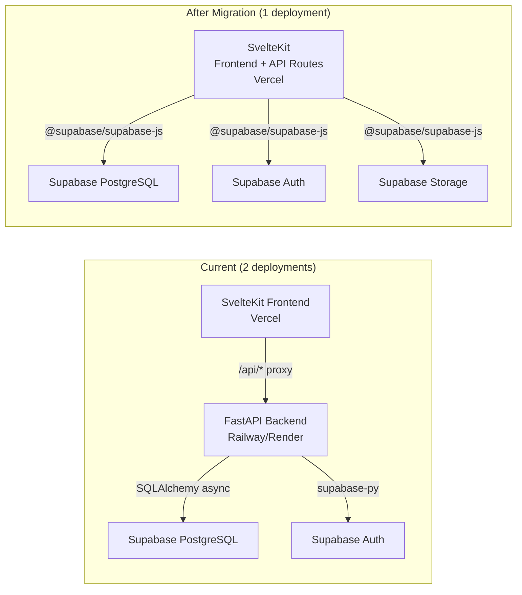

# Migrate FastAPI Backend → SvelteKit API Routes

Eliminate the separate Python backend by moving all API logic into SvelteKit `+server.ts` routes. This enables a **single Vercel deployment** (frontend + API) with zero extra hosting costs.

## User Review Required

> [!IMPORTANT]
> **This is a large migration** — 14 active route modules (~3,500 lines of Python) will be rewritten in TypeScript. The API contract (request/response shapes) stays identical so the frontend client (`$lib/api.ts`) requires **zero changes**. The database schema also stays identical (Supabase PostgreSQL).

> [!WARNING]
> **4 route files use legacy Beanie/MongoDB** and are NOT registered in `main.py`: `attachments.py`, `audit.py` (viewer), `comments.py`, `share.py`. These are currently non-functional. See Open Questions below on whether to port them.

> [!CAUTION]
> **File uploads will change**. The current backend writes files to local disk (`settings.upload_dir`). Vercel serverless functions have **no persistent filesystem**. We must migrate to **Supabase Storage** for exploratory session screenshots and run attachments.

## Open Questions

> [!IMPORTANT]
> **Q1: Legacy Beanie routes** — The 4 non-functional routes (comments, attachments, share tokens, audit viewer) are dead code. Should we:
> - **(a)** Skip them entirely (recommended — port later when needed)
> - **(b)** Port them to Supabase as part of this migration

> [!IMPORTANT]
> **Q2: Dashboard raw SQL** — The dashboard uses heavy PostgreSQL-specific queries (`jsonb_array_elements`, `DATE()`, aggregation). Two options:
> - **(a)** Create **Supabase Database Functions** (PostgreSQL `CREATE FUNCTION`) and call them via `supabase.rpc()` (recommended — keeps complex SQL in the DB where it belongs)
> - **(b)** Use a raw pg client like `postgres` (npm) for direct SQL access alongside Supabase JS

> [!IMPORTANT]
> **Q3: Rate limiting** — The current backend uses `slowapi` for rate limiting (only on attachment uploads). Vercel has built-in WAF/rate limiting on Pro plans, but the free plan does not. Should we:
> - **(a)** Drop rate limiting for now (fine for low-traffic internal tool)
> - **(b)** Add simple in-memory rate limiting (won't work well in serverless — no shared state)

> [!IMPORTANT]
> **Q4: Alembic migrations** — The current setup uses Alembic to manage the DB schema. After migration, there's no Python in the project. Should we:
> - **(a)** Keep the `backend/alembic` directory as a standalone migration tool (run locally with Python when needed)
> - **(b)** Switch to Supabase Dashboard / SQL migrations

---

## Architecture Overview



### Key Design Decisions

| Concern | Current (Python) | After Migration (TypeScript) |
|---------|-----------------|------------------------------|
| **DB access** | SQLAlchemy async ORM | Supabase JS client (PostgREST) + RPC for complex queries |
| **Auth** | `supabase-py` → `get_user(token)` | `@supabase/supabase-js` → `getUser(token)` |
| **RBAC** | FastAPI `Depends()` chain | Shared helper functions in `$lib/server/` |
| **File uploads** | Local filesystem (`upload_dir`) | Supabase Storage (bucket: `attachments`) |
| **Notifications** | `httpx` → Slack/webhooks/Jira | `fetch()` → same endpoints |
| **Audit log** | Fire-and-forget DB insert | Same, via Supabase client |
| **Rate limiting** | `slowapi` | Dropped (or Vercel WAF on Pro) |
| **Security headers** | Custom middleware | SvelteKit `handle` hook in `hooks.server.ts` |

---

## Proposed Changes

### Server-Side Foundation

New shared utilities that all API routes will use.

#### [NEW] [supabase.ts](file:///Users/adrian/work/new_idea/frontend/src/lib/server/supabase.ts)

Server-side Supabase admin client (uses `SUPABASE_SERVICE_ROLE_KEY`). This replaces `backend/app/core/supabase_client.py`.

```typescript
// Creates a Supabase admin client for server-side use
// Uses service role key for DB access (bypasses RLS)
```

#### [NEW] [auth.ts](file:///Users/adrian/work/new_idea/frontend/src/lib/server/auth.ts)

JWT validation + user upsert. Replaces `backend/app/core/deps.py`.

- `getAuthUser(request)` — validate Bearer token via `supabase.auth.getUser(token)`, upsert user row if first login, return user object or throw 401
- `getOptionalUser(request)` — same but returns `null` instead of throwing

#### [NEW] [permissions.ts](file:///Users/adrian/work/new_idea/frontend/src/lib/server/permissions.ts)

RBAC helpers. Replaces `backend/app/core/permissions.py`.

- `requireRole(user, project, ...roles)` — throws 403 if insufficient
- `hasRole(user, project, ...roles)` — boolean check
- Role hierarchy: `viewer < qa < manager < admin`

#### [NEW] [projects.ts](file:///Users/adrian/work/new_idea/frontend/src/lib/server/projects.ts)

Project resolution. Replaces `backend/app/core/projects.py`.

- `getActiveProject(request, supabase)` — resolve project from `X-Project-Id` or `X-Project-Slug` header, fallback to default
- `nextCaseCode(projectId, supabase)` — atomic counter via Supabase RPC function
- `userRolesInProject(user, project)` — combine global roles with per-project overrides

#### [NEW] [audit.ts](file:///Users/adrian/work/new_idea/frontend/src/lib/server/audit.ts)

Fire-and-forget audit logging. Replaces `backend/app/core/audit.py`.

#### [NEW] [notify.ts](file:///Users/adrian/work/new_idea/frontend/src/lib/server/notify.ts)

Outbound notifications (Slack, webhooks, Jira). Replaces `backend/app/core/notify.py`. Uses `fetch()` instead of `httpx`.

#### [NEW] [helpers.ts](file:///Users/adrian/work/new_idea/frontend/src/lib/server/helpers.ts)

Shared utilities:
- `json(data, status)` — create JSON Response
- `error(status, detail)` — create error Response matching current `{detail: "..."}` format
- `parseBody<T>(request)` — parse and validate JSON body
- `getProjectHeaders(request)` — extract `X-Project-Id` / `X-Project-Slug`

---

### SvelteKit Hooks

#### [NEW] [hooks.server.ts](file:///Users/adrian/work/new_idea/frontend/src/hooks.server.ts)

Replaces FastAPI's `_SecurityHeadersMiddleware` and CORS middleware:
- Add security headers (`X-Content-Type-Options`, `X-Frame-Options`, etc.)
- CORS is handled by Vercel/SvelteKit automatically for same-origin requests (no separate backend = no CORS needed)

---

### API Route Migration

Each FastAPI router becomes a SvelteKit `+server.ts` file. The URL structure changes from proxy-based to direct:

| Current (via proxy) | New (SvelteKit route) | FastAPI source |
|---------------------|----------------------|----------------|
| `/api/auth/me` | `/api/auth/me/+server.ts` | `auth.py` |
| `/api/cases` | `/api/cases/+server.ts` | `cases.py` |
| `/api/cases/[id]` | `/api/cases/[id]/+server.ts` | `cases.py` |
| `/api/cases/bulk` | `/api/cases/bulk/+server.ts` | `cases.py` |
| `/api/cases/count` | `/api/cases/count/+server.ts` | `cases.py` |
| `/api/cases/[id]/revisions` | `/api/cases/[id]/revisions/+server.ts` | `cases.py` |
| `/api/cases/[id]/archive` | `/api/cases/[id]/archive/+server.ts` | `cases.py` |
| `/api/cases/[id]/restore` | `/api/cases/[id]/restore/+server.ts` | `cases.py` |
| `/api/dashboard/overview` | `/api/dashboard/overview/+server.ts` | `dashboard.py` |
| `/api/dashboard/coverage` | `/api/dashboard/coverage/+server.ts` | `dashboard.py` |
| `/api/dashboard/flakiness` | `/api/dashboard/flakiness/+server.ts` | `dashboard.py` |
| `/api/dashboard/top-failing` | `/api/dashboard/top-failing/+server.ts` | `dashboard.py` |
| `/api/dashboard/release-readiness` | `/api/dashboard/release-readiness/+server.ts` | `dashboard.py` |
| `/api/defects` | `/api/defects/+server.ts` | `defects.py` |
| `/api/defects/[id]` | `/api/defects/[id]/+server.ts` | `defects.py` |
| `/api/defects/[id]/link` | `/api/defects/[id]/link/+server.ts` | `defects.py` |
| `/api/defects/[id]/external` | `/api/defects/[id]/external/+server.ts` | `defects.py` |
| `/api/defects/[id]/external/[extId]` | `/api/defects/[id]/external/[extId]/+server.ts` | `defects.py` |
| `/api/environments` | `/api/environments/+server.ts` | `environments.py` |
| `/api/environments/[id]` | `/api/environments/[id]/+server.ts` | `environments.py` |
| `/api/exploratory-sessions` | `/api/exploratory-sessions/+server.ts` | `exploratory_sessions.py` |
| `/api/exploratory-sessions/[id]` | `/api/exploratory-sessions/[id]/+server.ts` | `exploratory_sessions.py` |
| `/api/exploratory-sessions/[id]/pause` | `...pause/+server.ts` | `exploratory_sessions.py` |
| `/api/exploratory-sessions/[id]/resume` | `...resume/+server.ts` | `exploratory_sessions.py` |
| `/api/exploratory-sessions/[id]/complete` | `...complete/+server.ts` | `exploratory_sessions.py` |
| `/api/exploratory-sessions/[id]/bugs` | `...bugs/+server.ts` | `exploratory_sessions.py` |
| `/api/exploratory-sessions/[id]/bugs/[bugId]` | `...bugs/[bugId]/+server.ts` | `exploratory_sessions.py` |
| `/api/exploratory-sessions/[id]/screenshots` | `...screenshots/+server.ts` | `exploratory_sessions.py` |
| `/api/exploratory-sessions/[id]/screenshots/[ssId]` | `...screenshots/[ssId]/+server.ts` | `exploratory_sessions.py` |
| `/api/milestones` | `/api/milestones/+server.ts` | `milestones.py` |
| `/api/milestones/[id]` | `/api/milestones/[id]/+server.ts` | `milestones.py` |
| `/api/plans` | `/api/plans/+server.ts` | `plans.py` |
| `/api/plans/[id]` | `/api/plans/[id]/+server.ts` | `plans.py` |
| `/api/plans/[id]/cases` | `/api/plans/[id]/cases/+server.ts` | `plans.py` |
| `/api/projects` | `/api/projects/+server.ts` | `projects.py` |
| `/api/projects/current` | `/api/projects/current/+server.ts` | `projects.py` |
| `/api/projects/[id]` | `/api/projects/[id]/+server.ts` | `projects.py` |
| `/api/requirements` | `/api/requirements/+server.ts` | `requirements.py` |
| `/api/requirements/[id]` | `/api/requirements/[id]/+server.ts` | `requirements.py` |
| `/api/requirements/coverage-matrix` | `/api/requirements/coverage-matrix/+server.ts` | `requirements.py` |
| `/api/reviews` | `/api/reviews/+server.ts` | `reviews.py` |
| `/api/reviews/[id]/decide` | `/api/reviews/[id]/decide/+server.ts` | `reviews.py` |
| `/api/runs` | `/api/runs/+server.ts` | `runs.py` |
| `/api/runs/my-queue` | `/api/runs/my-queue/+server.ts` | `runs.py` |
| `/api/runs/[id]` | `/api/runs/[id]/+server.ts` | `runs.py` |
| `/api/runs/[id]/results/[idx]` | `/api/runs/[id]/results/[idx]/+server.ts` | `runs.py` |
| `/api/runs/[id]/results/[idx]/assign` | `...assign/+server.ts` | `runs.py` |
| `/api/runs/[id]/rerun-failed` | `/api/runs/[id]/rerun-failed/+server.ts` | `runs.py` |
| `/api/runs/[id]/finish` | `/api/runs/[id]/finish/+server.ts` | `runs.py` |
| `/api/steps` | `/api/steps/+server.ts` | `steps.py` |
| `/api/steps/[id]` | `/api/steps/[id]/+server.ts` | `steps.py` |
| `/api/suites` | `/api/suites/+server.ts` | `suites.py` |
| `/api/suites/[id]` | `/api/suites/[id]/+server.ts` | `suites.py` |
| `/api/suites/[id]/cases` | `/api/suites/[id]/cases/+server.ts` | `suites.py` |
| `/api/suites/[id]/cases/[caseId]` | `/api/suites/[id]/cases/[caseId]/+server.ts` | `suites.py` |
| `/api/suites/[id]/reparent` | `/api/suites/[id]/reparent/+server.ts` | `suites.py` |
| `/api/suites/[id]/quick-case` | `/api/suites/[id]/quick-case/+server.ts` | `suites.py` |
| `/api/healthz` | `/api/healthz/+server.ts` | `main.py` |

**Total: ~55 `+server.ts` files** across 14 route groups.

---

### Supabase Database Functions (RPC)

Complex queries that can't be expressed via PostgREST need PostgreSQL functions. These should be created via Supabase SQL Editor or a migration.

#### [NEW] Supabase SQL migration

```sql
-- 1. Atomic case code counter
CREATE OR REPLACE FUNCTION next_case_code(p_project_id UUID)
RETURNS TABLE(code_prefix TEXT, next_code INT) AS $$
  UPDATE projects
  SET next_code = projects.next_code + 1
  WHERE id = p_project_id
  RETURNING projects.code_prefix, projects.next_code - 1 AS next_code;
$$ LANGUAGE sql;

-- 2. Dashboard: daily trend (last 14 days)
CREATE OR REPLACE FUNCTION dashboard_trend(p_project_id UUID, p_since TIMESTAMPTZ)
RETURNS TABLE(day DATE, passed BIGINT, total BIGINT) AS $$
  SELECT
    DATE(started_at AT TIME ZONE 'UTC') AS day,
    SUM((summary->>'passed')::int) AS passed,
    SUM((summary->>'total')::int) AS total
  FROM runs
  WHERE project_id = p_project_id AND started_at >= p_since
  GROUP BY day ORDER BY day;
$$ LANGUAGE sql;

-- 3. Dashboard: coverage by component
CREATE OR REPLACE FUNCTION dashboard_coverage(p_project_id UUID)
RETURNS TABLE(component TEXT, count BIGINT, p0 BIGINT, p1 BIGINT) AS $$
  SELECT
    COALESCE(NULLIF(component, ''), '(uncategorized)') AS component,
    COUNT(*) AS count,
    SUM(CASE WHEN priority = 'P0' THEN 1 ELSE 0 END) AS p0,
    SUM(CASE WHEN priority = 'P1' THEN 1 ELSE 0 END) AS p1
  FROM test_cases
  WHERE project_id = p_project_id AND archived = FALSE
  GROUP BY component ORDER BY count DESC;
$$ LANGUAGE sql;

-- 4. Dashboard: flakiness
CREATE OR REPLACE FUNCTION dashboard_flakiness(p_project_id UUID)
-- ... (similar pattern)

-- 5. Dashboard: top-failing
CREATE OR REPLACE FUNCTION dashboard_top_failing(p_project_id UUID)
-- ... (similar pattern)

-- 6. Milestone stats
CREATE OR REPLACE FUNCTION milestone_stats(p_project_id UUID, p_milestone_id UUID)
-- ... (similar pattern)

-- 7. Requirement traceability
CREATE OR REPLACE FUNCTION requirement_last_status(p_project_id UUID, p_case_ids UUID[])
-- ... (similar pattern)
```

---

### Files to Remove/Modify

#### [DELETE] [+server.ts](file:///Users/adrian/work/new_idea/frontend/src/routes/api/[...path]/+server.ts)

The catch-all reverse proxy to the backend. No longer needed since API routes live in SvelteKit now.

#### [MODIFY] [vite.config.js](file:///Users/adrian/work/new_idea/frontend/vite.config.js)

Remove the `/api` proxy configuration since there's no separate backend to proxy to.

#### [MODIFY] [vercel.json](file:///Users/adrian/work/new_idea/vercel.json)

Remove the API rewrite rule and simplify. The frontend build handles everything.

#### [MODIFY] [.env.example](file:///Users/adrian/work/new_idea/.env.example)

Add `SUPABASE_SERVICE_ROLE_KEY` to the frontend env (needed server-side only). Remove `DATABASE_URL` (no longer using SQLAlchemy).

---

### New Dependencies

Add to `frontend/package.json`:

```json
{
  "dependencies": {
    "@supabase/supabase-js": "^2.38.0"  // already present
  }
}
```

No new dependencies needed. The Supabase JS client is already installed and handles both auth and database access.

---

## Execution Plan — Phased Approach

### Phase 1: Foundation (Server utilities + hooks)
1. Create `$lib/server/supabase.ts` — admin client
2. Create `$lib/server/auth.ts` — JWT validation + user upsert
3. Create `$lib/server/permissions.ts` — RBAC
4. Create `$lib/server/projects.ts` — project resolution
5. Create `$lib/server/audit.ts` — audit logging
6. Create `$lib/server/notify.ts` — outbound notifications
7. Create `$lib/server/helpers.ts` — shared response helpers
8. Create `src/hooks.server.ts` — security headers

### Phase 2: Simple CRUD routes (validate the pattern works)
9. `/api/healthz` — smoke test
10. `/api/auth/me` + `/api/auth/logout`
11. `/api/environments` — simplest full CRUD
12. `/api/steps` — simple CRUD
13. `/api/milestones` — CRUD + RPC for stats

### Phase 3: Core data routes
14. `/api/projects` — CRUD + current
15. `/api/cases` — CRUD + bulk + revisions + archive/restore
16. `/api/suites` — CRUD + reparent + case management + quick-case
17. `/api/plans` — CRUD + case resolution

### Phase 4: Execution routes
18. `/api/runs` — CRUD + result updates + assign + rerun + finish
19. `/api/reviews` — submit + decide + cancel
20. `/api/defects` — CRUD + link/unlink + external links

### Phase 5: Analytics + advanced
21. `/api/dashboard/*` — overview, coverage, flakiness, top-failing, release-readiness (requires RPC functions)
22. `/api/requirements` — CRUD + traceability + coverage matrix
23. Create Supabase database functions (SQL migration)

### Phase 6: File uploads (requires Supabase Storage)
24. `/api/exploratory-sessions` — full migration including screenshot upload/download via Supabase Storage

### Phase 7: Cleanup
25. Remove `src/routes/api/[...path]/+server.ts` (reverse proxy)
26. Update `vite.config.js` (remove proxy)
27. Update `vercel.json` (simplify)
28. Update `README.md` (new setup instructions)
29. Update `.env.example`

---

## Verification Plan

### Automated Tests
- After each phase, manually test the migrated endpoints using the existing frontend
- Run `npm run build` to verify no TypeScript errors
- Run `npm run check` for Svelte type checking

### Manual Verification
1. Start the SvelteKit dev server (`npm run dev`) — no backend needed
2. Login via Supabase Auth
3. Verify each feature area works:
    - Create/list/update/delete test cases
    - Create and execute test runs
    - Dashboard loads with real data
    - File uploads work (exploratory sessions)
4. Deploy to Vercel preview and test
5. Deploy to production

### Incremental Testing Strategy
During migration, the catch-all proxy can remain as a fallback. We migrate one route group at a time — SvelteKit's file-based routing takes precedence over the catch-all, so migrated routes will use the new TS code while unmigrated ones still proxy to the Python backend. This allows **gradual, zero-downtime migration**.

---

## Estimated Effort

| Phase | Files | Estimated Time |
|-------|-------|---------------|
| Phase 1: Foundation | 8 | 2-3 hours |
| Phase 2: Simple CRUD | 10 | 2-3 hours |
| Phase 3: Core data | 20 | 4-6 hours |
| Phase 4: Execution | 15 | 3-4 hours |
| Phase 5: Analytics | 8 + SQL | 3-4 hours |
| Phase 6: File uploads | 5 | 2-3 hours |
| Phase 7: Cleanup | 5 | 1 hour |
| **Total** | **~71** | **~17-24 hours** |
